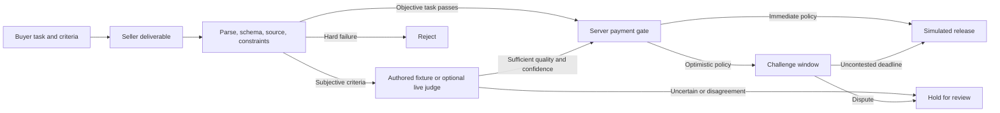

# Verifier — Good work. Then payment.

An interactive research prototype for checking an agent's work **before** releasing an x402 payment. The default app is a wallet-free demonstration: visitors edit deliverables, run verification, and see payment released, blocked, held, or disputed.

[**Open the interactive demo**](https://x402-verifier-lab.vercel.app) · [Interview walkthrough](docs/INTERVIEW.md)

**September 2026:** the new verification lab is active. The active demo and next testnet integration target **Solana devnet only**. `/testnet` shows that integration status; the earlier Base prototype is archived at `/archive/base-sepolia`.

## Run the demo

```bash
pnpm install
pnpm dev:dashboard
```

Open [localhost:4022](http://localhost:4022). No wallet, API key, facilitator process, or blockchain connection is needed. Node 22 is used for deployment; pnpm 10.23.0 is pinned.

## What you can demonstrate

- **Seven task families:** invoice extraction, code behavior, summarization, translation, product copy, research recommendations, and an acceptance contract.
- **Real deterministic checks:** JSON parsing, strict schema validation, source/reference comparison, length and quantity constraints, and buyer-owned test vectors for a bounded operation language. The code example does not execute arbitrary JavaScript.
- **Subjective evaluation:** labeled, authored example judgments for semantic tasks; an optional live Anthropic single-model adapter. Edited subjective text without a live evaluator is held, not given a fabricated score.
- **Stepped policies:** deterministic-only, single judge, illustrative multi-judge consensus, uncertainty escalation, and optimistic dispute windows. Hard failures cannot be overridden by a high average score.
- **Payment gate:** the server binds a receipt to the task, exact artifact, policy, amount, network, and expiry. It blocks tampering, early release, rejected/held/disputed payments, and repeated releases within the same process.
- **Review and recourse:** a 20-second simulated challenge window and explicitly labeled reviewer role-play. A dispute freezes payment before release. Bond amounts are illustrative; none are collected.
- **Research reference:** 15 approaches across work quality, identity/provenance/trust, and timing, with implementation status and limits. Includes a verification-cost calculator and interview walkthrough.

The demo is a **Solana devnet simulation**. The active API rejects other networks. No funds move, no transaction is broadcast, no escrow is deployed, and the simulated payment ID is never presented as an explorer transaction.

## Important boundaries

The public lab is a simulator, not a production payment service. Its ledger, authentication key, and replay protection are process-local and expire after ten minutes. A restart or a request routed to another process fails closed and asks the visitor to run verification again. Real settlement would require shared durable state, authenticated participants and reviewers, buyer-signed acceptance terms, and chain reconciliation.

A digest identifies the reviewed artifact; it is **not** a proof that the output is true or that a particular model executed. Authored confidence and votes are illustrative. Live-model confidence is self-reported, not calibrated. Neither the example set nor the tests measure model accuracy.

No public server-wallet payments are allowed. Production `/api/agent/weather` returns 403 even if a wallet key is present.

## Optional live judge

Copy `.env.example` to the repository-root `.env`, then set:

```dotenv
ANTHROPIC_API_KEY=<your server-side key>
JUDGE_MODEL=claude-sonnet-4-6
LAB_ENABLE_LIVE_JUDGE=true
LAB_LIVE_JUDGE_TOKEN=<a long random access token>
```

Restart the dashboard. “Live judge access” appears in the deliverable panel. Enable it and enter the access token. The provider key never reaches the browser. This mode makes a paid provider request; it is disabled by default. No key is included in the project.

The adapter uses a fixed rubric, bounded input, a 25-second timeout, exact named score dimensions, and strict response validation. Provider errors and malformed results never fall back to fixtures. Live cross-provider consensus is not configured: if the chosen policy requires a panel, work stays held. For deployment, set the same server environment variables on the hosting project.

## Architecture



| Path | Responsibility |
|---|---|
| `apps/dashboard/components/lab` | Workbench, flow, receipt, reference guide, economics |
| `apps/dashboard/lib/verification` | Task contracts, deterministic checks, judge policies, live adapter, demo ledger |
| `apps/dashboard/app/api/lab` | Validated verify/settle commands in one server route |
| `apps/dashboard/app/testnet` | Solana-only integration status and requirements |
| `apps/dashboard/app/archive/base-sepolia` | Historical wallet dashboard, with isolated wallet providers |
| `apps/facilitator` | Original Express proxy and summarization judge; unverified settlement blocked by default |
| `apps/demo-service` | Original paid weather and summary endpoints |
| `apps/buyer-agent`, `packages/agent-pay` | Original Base Sepolia buyer tooling |

## Archived Base Sepolia path

The historical integration used real testnet USDC and an upstream `x402.org` facilitator. The seller called `/judge`, but `/settle` was a payment-only proxy. A judge approval was therefore **not an independently enforced quality gate**. The new lab demonstrates that policy boundary without claiming the historical integration already had it.

To deliberately reproduce the old baseline locally, configure the test wallet, seller address and local services from `.env.example`, set `ALLOW_UNVERIFIED_TESTNET_SETTLEMENT=true`, and run:

```bash
pnpm dev:all
```

Open `/archive/base-sepolia`. The archived baseline settlement route is restricted to Base Sepolia and is blocked by default. The weather endpoint has no work judge. The summarization seller-side judge remains available with an Anthropic key. Standalone `/judge` approvals are now logged as `approved`, not `settled`.

Recorded transactions from April 23, 2026 (historical repository evidence; not rerun for this demo):

| Milestone | Transaction |
|---|---|
| First baseline | [0xc105…0c4f](https://sepolia.basescan.org/tx/0xc105ed89ed040dda01a7687dd12ba5b55782b38c3da4599e638d21e4a0ee0c4f) |
| Facilitator as middleman | [0x15d2…27c5c](https://sepolia.basescan.org/tx/0x15d2a919fa77b368be9f062b4f3028d1df41edf75e0c81ba54e1dbda3db27c5c) |
| Dashboard-triggered | [0xfbe3…cd4e5](https://sepolia.basescan.org/tx/0xfbe369e796f6e6c66a936039feae77b731e9f0a82d6c51871eb23aa71decd4e5) |
| Browser-verified baseline | [0x17de…d3744](https://sepolia.basescan.org/tx/0x17de059f92990c9832363fe9fa7b04d181898a3e680aa9d1ba75493f27ad3744) |

## Verify and present

```bash
pnpm test
pnpm typecheck
pnpm build
```

See [verification record](docs/VERIFICATION.md), [two-minute interview walkthrough](docs/INTERVIEW.md), and [research-to-demo map](docs/RESEARCH-MAP.md).

The production build uses Webpack with `.js` → TypeScript extension aliases for the original NodeNext workspace packages. Existing optional wallet-dependency warnings are isolated to the legacy dashboard.

## Next integration steps — Solana devnet only

1. Authenticate and sign the buyer's exact acceptance contract, payee, artifact commitment, amount, network, and expiry.
2. Replace the demo ledger with transactional shared storage and idempotent settlement reconciliation.
3. Build the live version exclusively for Solana devnet and validate new settlements with explorer evidence; no EVM fallback. See [Solana testnet direction](docs/SOLANA-TESTNET.md).
4. Add real independent model providers, calibrated labeled evaluations, authenticated arbitration and an explicit escrow/hold design for disputes.
5. Evaluate learned metrics, verifiable execution, reputation, and streaming only where the task requires them.

## Sources and license

Protocol framing checked against the [x402 facilitator documentation](https://docs.x402.org/core-concepts/facilitator), [network support](https://docs.x402.org/core-concepts/network-and-token-support), and [UMA optimistic oracle design](https://docs.uma.xyz/protocol-overview/how-does-umas-oracle-work). These are references, not integrations or endorsements.

Built with AI assistance from a research-led product specification. [MIT](LICENSE).
