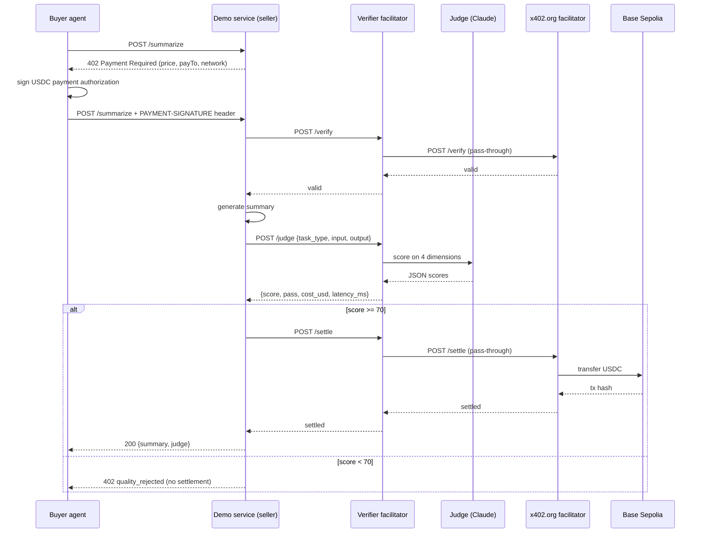

# Verifier Facilitator x402

An x402 payment facilitator that puts an LLM-as-judge quality check between an agent paying for work and the payment settling. If the work is bad, the payment does not settle.

## Status (September 2026)

**V1 prototype. Stalled on 2026-04-29. Not maintained.**

What actually works, as of the last commit:

- Four real settlements on Base Sepolia (testnet USDC) through the full path: buyer agent → paid demo service → this facilitator → upstream `x402.org` facilitator → chain. Transaction hashes are listed below.
- A browser dashboard that connects a wallet, funds an agent wallet with test USDC, runs a paid request in either manual-wallet or agent-wallet mode, and shows each hop of the payment path live.
- One judge rubric (summarization) out of the seven task types the design called for. The judge scores four dimensions with Claude, returns a 0–100 score, and passes at 70 or above. The demo service's `POST /summarize` route calls the judge before returning; a failed verdict returns HTTP 402 and the payment is not settled. A `mode: "bad"` flag on the request forces a deliberately poor summary so you can watch it get rejected.
- Every judge call is logged to a local SQLite file with score, model, latency and cost.

What does not work, honestly:

- The judge runs as a separate `/judge` endpoint that the *seller* calls. The facilitator's own `/verify` and `/settle` routes are still plain pass-through proxies to `x402.org`. Wiring the verdict into the settle path itself was the next session and never happened.
- Six of the seven rubrics were never written. The `/weather` demo route has no quality check at all.
- The original plan targeted 70 scripted transactions and a demo to Circle's Arc developer-relations team. Neither happened.

### What I learned

Three things from the research that ran alongside this build ([Agentic Payments Research](https://github.com/ClawdGItMan/agentic-payments-research)), each of which cut against the reason I started it:

1. **The judge does not pay for itself at micropayment scale.** An LLM evaluation costs $0.01–$0.15. The average x402 transaction was about $0.20. That makes verification 5–75% of the transaction value. The whole product is either a non-starter or trivial overhead depending on one number I do not control: whether agent transactions grow past roughly $5.
2. **The rail I built on had no organic demand yet.** x402 daily transactions fell 92% from their December 2025 peak, and roughly half of what remained looked like wash or self-trading. Solana also quietly overtook Base on daily x402 volume while I was building on Base. A quality gate on a rail nobody is using is a solution with no queue.
3. **Payment rails earn on throughput, and a quality gate reduces throughput.** Nobody whose revenue is volume wants to be the party that says "this doesn't settle." That is the structural reason the verification layer stays empty, and it makes a third-party facilitator a hard *business*, not just a hard build. I had treated it as a build problem.

## Why this exists

Every x402 facilitator verifies the **payment**: signature, nonce, on-chain settlement. None of them verify the **work**. For subjective agent tasks (writing, analysis, summarization) a valid signature is not enough; the paying agent needs some way to know the output was worth paying for. This repo was an attempt to build that gate as a drop-in facilitator, so a seller could point at it instead of `x402.org` and get quality-gated settlement without changing anything else.

## Architecture



The repo is a pnpm monorepo:

| Path | What it is |
|---|---|
| `apps/facilitator` | Express service. Proxies `/supported`, `/verify`, `/settle` to the upstream facilitator; hosts `/judge`; streams events over SSE for the dashboard; logs to SQLite. |
| `apps/demo-service` | A paid seller. `GET /weather` (plain x402, no judge) and `POST /summarize` (Claude-generated summary, judged before return). |
| `apps/buyer-agent` | Script that pays for `/weather` end to end from a test wallet. |
| `apps/dashboard` | Next.js browser dashboard for watching the payment path with a real wallet. |
| `packages/agent-pay` | Small wrapper around `@x402/fetch` that emits step-by-step events. |
| `packages/shared` | Task types, judge result shape, pass/reject thresholds (70 / 40). |

## Recorded settlements (Base Sepolia)

| Milestone | Date | Tx |
|---|---|---|
| First baseline x402 settlement via `x402.org` | 2026-04-23 | `0xc105ed89ed040dda01a7687dd12ba5b55782b38c3da4599e638d21e4a0ee0c4f` |
| First settlement through this facilitator as middleman | 2026-04-23 | `0x15d2a919fa77b368be9f062b4f3028d1df41edf75e0c81ba54e1dbda3db27c5c` |
| First dashboard-triggered agent settlement | 2026-04-23 | `0xfbe369e796f6e6c66a936039feae77b731e9f0a82d6c51871eb23aa71decd4e5` |
| Latest browser-verified dashboard run | 2026-04-23 | `0x17de059f92990c9832363fe9fa7b04d181898a3e680aa9d1ba75493f27ad3744` |

Look them up on [sepolia.basescan.org](https://sepolia.basescan.org).

## How to run

Prerequisites: Node 20+, a Base Sepolia wallet with testnet USDC ([faucet.circle.com](https://faucet.circle.com)) and a little Base Sepolia ETH for gas, and an Anthropic API key for the judge and the summarizer.

```bash
npx pnpm@10.23.0 install
cp .env.example .env
npx pnpm@10.23.0 wallet:generate     # prints a fresh test wallet
```

Put the generated key in `.env` as `EVM_PRIVATE_KEY`, set `SELLER_EVM_ADDRESS` to any address you control, set `ANTHROPIC_API_KEY`, then fund the buyer address.

```bash
npx pnpm@10.23.0 dev:all             # facilitator :4020, demo service :4021, dashboard :4022
```

Open `http://localhost:4022`. Or, without the browser:

```bash
npx pnpm@10.23.0 dev:facilitator     # terminal 1
npx pnpm@10.23.0 dev:demo            # terminal 2
npx pnpm@10.23.0 tx:baseline         # terminal 3: pays for /weather, prints the settlement
```

To exercise the judge directly:

```bash
curl -X POST localhost:4021/summarize \
  -H 'content-type: application/json' \
  -d '{"source":"<long text>","max_length":300,"mode":"bad"}'
# -> 402 quality_rejected, with the judge's per-dimension scores
```

(The first call returns a 402 payment challenge; the buyer-agent and dashboard handle the signing. `scripts/SETUP.md` has the longer walkthrough.)

## Built with AI

I do not write code by hand. The design, session plan and rubric definitions were written first as documents; Claude Code built the monorepo from them across roughly six sessions in April 2026, and I judged progress by whether test transactions settled on chain. `CLAUDE.md` is the agent's working brief.

## License

[MIT](LICENSE).
